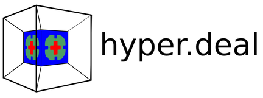

# hyper.deal

`hyper.deal` is an efficient, matrix-free finite-element library for solving
partial differential equations in two to six dimensions with high-order
discontinuous Galerkin methods. It builds upon the low-dimensional
finite-element library [deal.II](https://www.dealii.org/) to create low-dimensional
meshes and to operate on them individually. We combine these meshes via a tensor
product on the fly and provide new special-purpose highly optimized matrix-free
functions.

The library `hyper.deal` is freely available under the [LGPL 3.0 license](LICENSE.MD).
If you use `hyper.deal`, please cite the release paper:
```
@article{munch2020hyperdeal,
  title       = {hyper.deal: An efficient, matrix-free finite-element library for
                 high-dimensional partial differential equations},
  author      = {Munch, Peter and Kormann, Katharina and Kronbichler, Martin},
  year        = {2021},
  institution = {accepted for publication in ACM Transactions on Mathematical Software}
}
```
The paper has been accepted; the preprint can be found online on [arXiv](https://arxiv.org/abs/2002.08110)
(with the corrsponding [hyper.deal](https://github.com/hyperdeal/hyperdeal/tree/paper_release) 
and [deal.II](https://github.com/hyperdeal/dealii/tree/paper_release) branches).
The full list of publications using or related to `hyper.deal` can be found
[here](../../wiki/Publications).

We provide following useful resources:
- a WIKI (see [here](../../wiki/home))
- an online Doxygen documentation (see [here](https://hyperdeal.github.io/hyperdeal/))
- example programs presenting features of `hyper.deal` in the  folder [examples](examples)


For getting started, check out the [following site](../../wiki/Getting-started).

#### Continuous integration status:

[](https://github.com/hyperdeal/hyperdeal/actions?query=workflow%3ADoxygen)
[](https://github.com/hyperdeal/hyperdeal/actions?query=workflow%3AIndent)
[](https://github.com/hyperdeal/hyperdeal/actions?query=workflow%3A%22GitHub+CI%22)

## Authors

The principal developers are (in alphabetical order):

- [Katharina Kormann](https://www.ruhr-uni-bochum.de/ffm/Lehrstuehle/Kormann/) ([@kkormann](https://github.com/kkormann)), Ruhr University Bochum, DE
- [Martin Kronbichler](https://www.uni-augsburg.de/de/fakultaet/mntf/math/prof/hpc/team/kronbichler/) ([@kronbichler](https://github.com/kronbichler)), University of Augsburg, DE
- [Peter Munch](https://www.uni-augsburg.de/en/fakultaet/mntf/math/prof/hpc/team/munch/) ([@peterrum](https://github.com/peterrum)), University of Augsburg, DE

## Philosophy

The library `hyper.deal` is dedicated explicitly only to algorithms for high-dimensional finite-element methods. However, the close ties to `deal.II` enable us to use general-purpose FEM features from there. In particular, we are contributing to the `deal.II` project functionalities that have been developed with high-dimensions in mind, but are also useful for lower dimensions.

Via `deal.II`, we optionally also have access to other third-party libraries like `Trilinos`, `p4est`, `Metis`, or `PETSc`. Furthermore, a large variety of efficient off-the-shelf matrix-free physical solvers from the `deal.II`-based [ExaDG](https://github.com/exadg/exadg) project could be used to solve low-dimensional sub-problems and coupled to modules provided by `hyper.deal`.

The library `hyper.deal` is a community development project. Contributions by new developers are more than welcome! In the case of questions, please contact any of the principal developers listed above.
